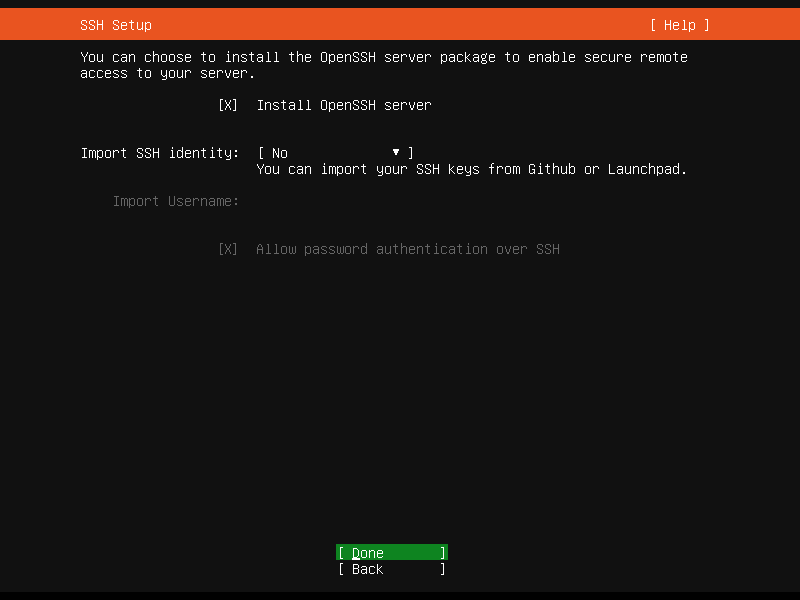
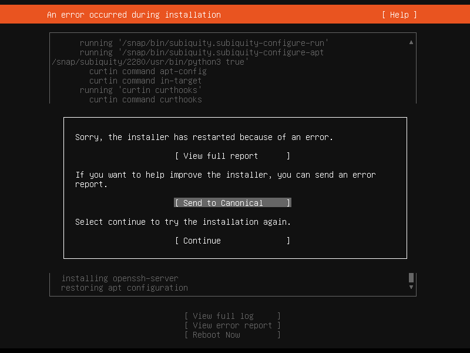
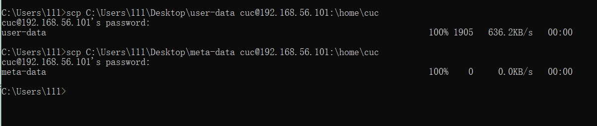
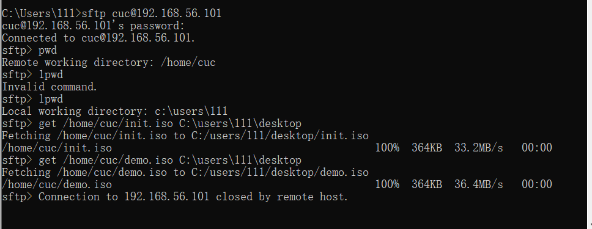
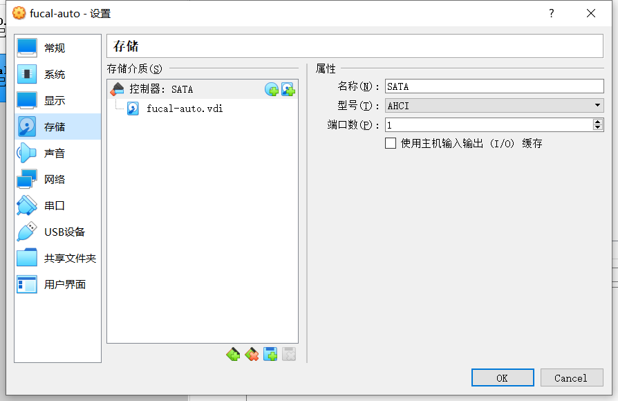
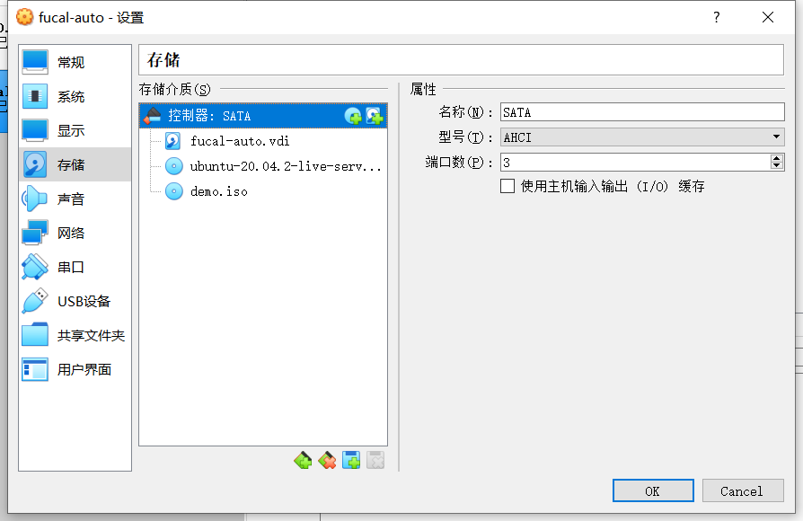
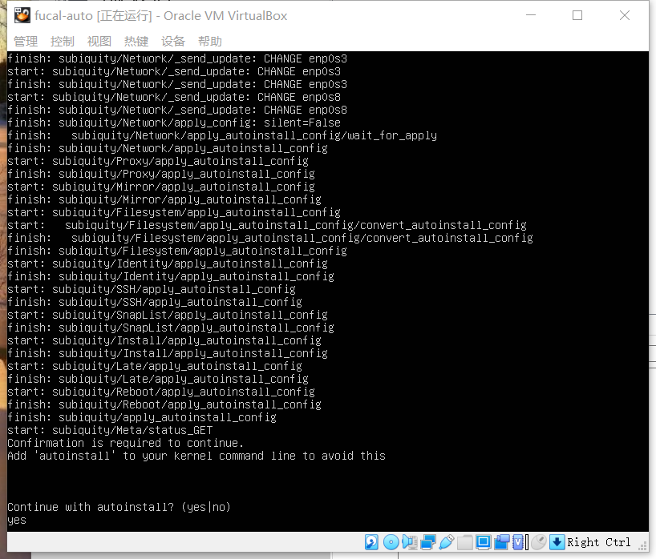
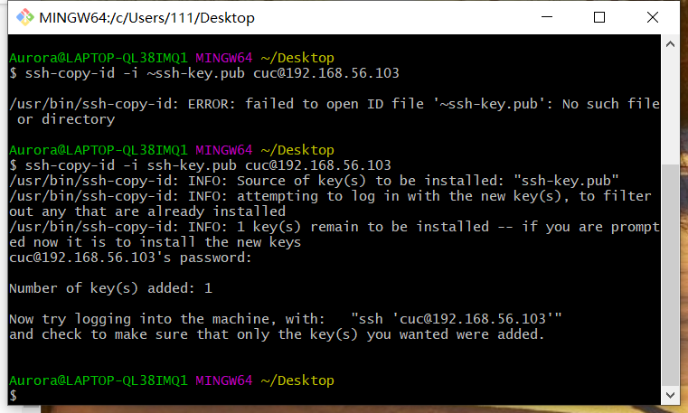
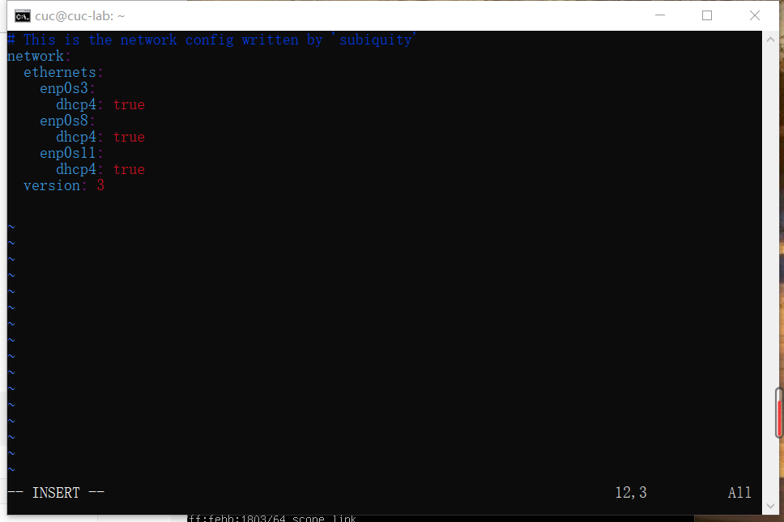

# Linux 第一次实验报告

## 一、实验目的

配置无人值守安装iso并在Vituralbox中完成自动化安装

## 二、实验环境

1、Virtualbox 虚拟机

2、Ubuntu 20.04 live Server 64bit

## 三、实验步骤

1、于官网下载Ubuntu安装镜像iso文件

2、手动安装Ubuntu

关键步骤简述：需导入iso 镜像文件，需要先add从系统文件中选择已经下载好的镜像；安装时许多步骤默认即可，在SSH Setup中利用空格键选中Install OpenSSH server,后面步骤默认done即可安装（很慢）。



3、第一次手动安装耗时较长，但依旧安装失败了（没有读懂原因）之后尝试了继续重装就OK了，且耗时不是很久



4、对比老师提供的user-data和从虚拟机下载的autoinstall-user-data修改生成新的user-data

5、新建一个空文件meta-data，然后将新的user-data和meta-data文件使用scp命令传输到虚拟机当中



6、合成镜像（刚开始口令不正确，在语雀中看到了看到了相同的问题，尝试用他的办法解决了）

```
genisoimage -input-charset utf-8 -output init.iso -volid cidata -joliet -rock user-data meta-data
```

7、将镜像传输到宿主机



8、新建一台虚拟机fucal-auto,严格按照课件中的步骤挂在两个镜像文件，同时设置好网络





9、设置好上述步骤，启动即可

稍后会出现 Contiune with autoinstall?(yes|no) 选择yes 摁回车即可实现无人值守的镜像安装。



## 四、实验问题

1、如何配置无人值守安装iso并在Virtualbox中完成自动化安装

由上述实验步骤说明

2、Virtualbox安装完Ubuntu之后新添加的网卡如何实现系统开机自动启用和自动获取IP

Ⅰ 配置免密登录

首先在宿主机的cmd中输入ssh-keygen.exe自动生成公私钥对

再将公钥上传到无人值守安装的虚拟机

在桌面右击打开Git Bash Here 输入 ssh-copy-id -i ssh-key.pub cuc@192.168.56.103 摁回车

此时需要输入该台虚拟机登录密码，即完成免密登录配置



Ⅱ 自动获取ip

输入配置网卡指令

sudo vim /etc/netplan/00-installer-config.yaml

在最初虚拟机设置时就已配置好两块网卡，尝试加入第三块（自行编辑net cnfig)



退出 net config

输入sudo netplan apply 即可

3、如何使用sftp在虚拟机和宿主机之间传输文件

```
# 连接远程服务器
sftp cuc@192.168.56.101
# 查看当前服务器路径
lpwd
# 查看远程服务器路径[默认用户家目录]
pwd
# 上传文件
put 当前路径 远程连接
# 下载文件
get 远程路径 当前路径
```

## 五、遇到问题及解决办法

1、手动安装虚拟机时，第一次没有安装成功（不是很懂原因）尝试重装后就顺利完成了

2、合成镜像时第一次口令错误，通过语雀看到遇到相同问题的同学，采用他的解决办法将口令更改为

`genisoimage -input-charset utf-8 -output init.iso -volid cidata -joliet -rock user-data meta-data`

即可成功安装

